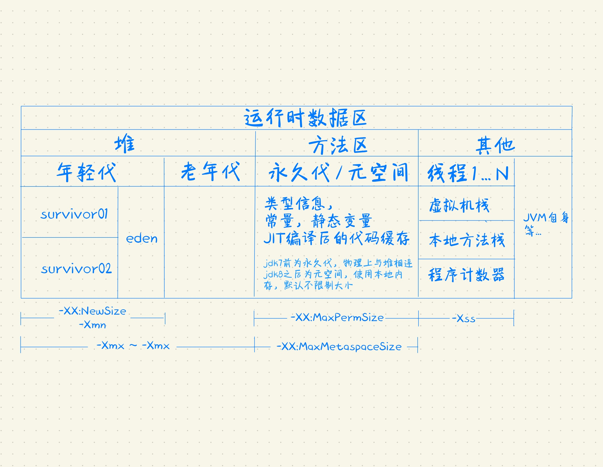

## 作业

### 01. 

题目：自定义一个 Classloader，加载一个 Hello.xlass 文件，执行 hello 方法，此文件内容是一个 Hello.class 文件所有字节（x=255-x）处理后的文件。文件群里提供。

解答：[自定义类加载器](com/prik/work01/MyClassLoader.java)

### 02. 

题目：画一张图，展示 Xmx、Xms、Xmn、Meta、DirectMemory、Xss 这些内存参数的关系。

解答：

